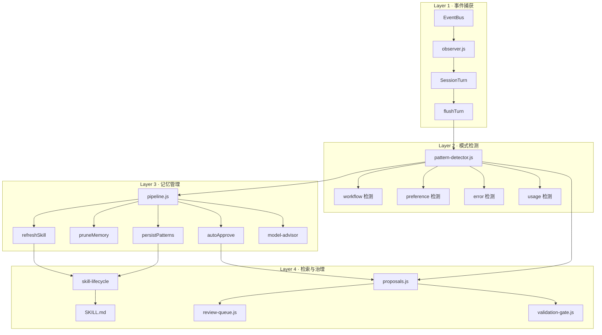
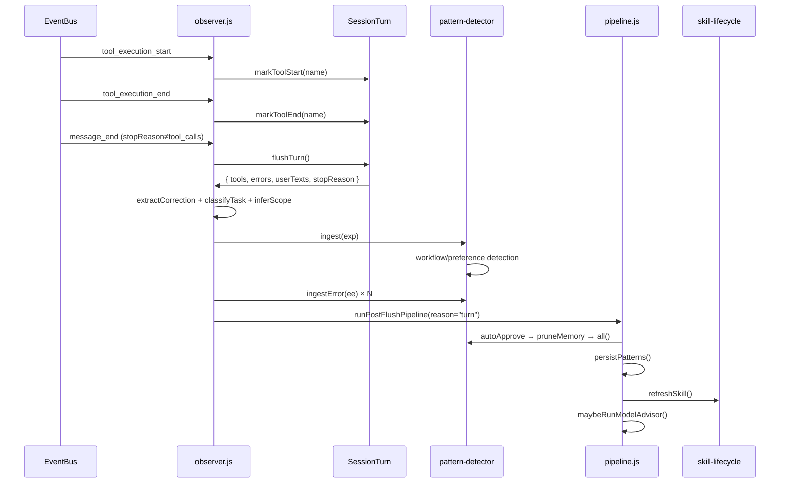
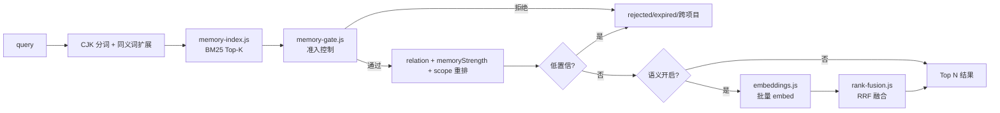
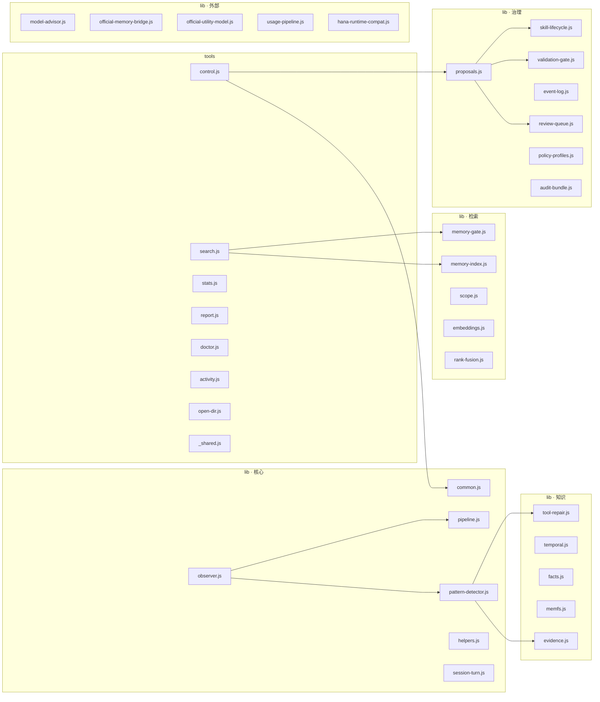

# Architecture

运行时自学习引擎的完整调用拓扑。28 个 lib 文件、9 个 tool 文件、1 个入口。

---

## 总览：四层管道



---

## 模块职责矩阵

### 入口

| 文件 | 行数 | 职责 |
|------|------|------|
| `index.js` | 787 | 插件生命周期、闭包装配、usage bootstrap、启动/关闭 |

### 核心引擎

| 文件 | 职责 | 被谁调用 |
|------|------|----------|
| `observer.js` | EventBus 订阅、SessionTurn 生命周期、flushTurn 触发 | index.js (createObserver) |
| `session-turn.js` | 单回合工具/错误/用户文本追踪 | observer.js |
| `pattern-detector.js` | 模式创建/强化/衰减/剪枝、catIndex、_linkRelations | observer.js, index.js |
| `pipeline.js` | post-flush 标准化管道：autoApprove→prune→persist→refresh→advisor | observer.js, index.js |

### 检索链路

| 文件 | 职责 | 调用顺序 |
|------|------|----------|
| `memory-index.js` | CJK-aware BM25 倒排索引（零依赖） | 第一步 |
| `memory-gate.js` | 准入控制：拒绝 rejected/ephemeral/过期/跨项目 | 第二步 |
| `scope.js` | 项目作用域推断与匹配 | gate 调用 |
| `embeddings.js` | 可选语义向量（默认关闭） | 第三步（RRF 融合） |
| `rank-fusion.js` | RRF 多路排序融合 | embeddings 调用 |
| `helpers.js` | 工具分类、错误分类、纠正提取、usage 去重、跨语言同义词 | 被 search 调用 |

### 治理链路

| 文件 | 职责 |
|------|------|
| `proposals.js` | 提案创建/应用/拒绝、diff 预览 |
| `review-queue.js` | 审核队列、审查状态管理 |
| `validation-gate.js` | 提案应用前验证门禁 |
| `event-log.js` | append-only 审计事件流、状态回放 |
| `skill-lifecycle.js` | SKILL.md 快照/裁剪/回滚、技能注册 |
| `policy-profiles.js` | conservative/balanced/autonomous 策略配置档 |
| `audit-bundle.js` | 本地审计包导出（脱敏 JSON + Markdown） |

### 知识与事实

| 文件 | 职责 |
|------|------|
| `common.js` | 艾宾浩斯衰减、知识分层、CJK token 估算、SKILL.md 构建、原子 I/O |
| `evidence.js` | 证据链：脱敏、截断、去重、溯源 |
| `temporal.js` | 事实有效期与覆盖语义（validFrom/validTo/supersedes） |
| `facts.js` | facts.json 持久化与检索适配 |
| `memfs.js` | 派生 Markdown 记忆视图（只读，可重建） |
| `tool-repair.js` | 错误分类的结构化修复计划 |

### 外部集成

| 文件 | 职责 |
|------|------|
| `model-advisor.js` | 小模型后台整理（默认关闭） |
| `official-memory-bridge.js` | Hanako 官方记忆只读桥 |
| `official-utility-model.js` | 小模型端点解析 |
| `hana-runtime-compat.js` | Pi 框架兼容层 |
| `usage-pipeline.js` | 用量采集、汇总、宿主能力快照 |

### 工具（对外 API）

| 文件 | 工具名 |
|------|--------|
| `tools/search.js` | `self_learning_search` |
| `tools/control.js` | `self_learning_control` |
| `tools/stats.js` | `self_learning_stats` |
| `tools/report.js` | `self_learning_report` |
| `tools/doctor.js` | `self_learning_doctor` |
| `tools/activity.js` | `self_learning_activity` |
| `tools/open-dir.js` | `self_learning_open_dir` |
| `tools/normalize-config.js` | 独立维护脚本 |
| `tools/_shared.js` | 工具共享上下文工厂 |

---

## 关键数据流

### Turn 完整生命周期



### 检索完整链路



### 记忆衰减与淘汰

```mermaid
flowchart TB
    P[pattern 创建] --> S[score = count×3 + bonus]
    S --> D{每天}
    D --> DC[decayedScore = score × 0.5^(age/halfLife)]
    DC --> PF{score-floor prune}
    PF -->|<1 且非 durable/手动批准| DEL[淘汰 + 清理 seqCache + 孤儿关系]
    PF -->|>=1| CAP{pool > 100?}
    CAP -->|是| WK[保留 durable + 手动批准<br/>其余按 memoryStrength 排序<br/>淘汰最弱]
    CAP -->|否| KEEP[保留]
    WK --> KEEP
```

---

## 依赖方向

原则：lib 模块不依赖 tools，tools 依赖 lib。不允许循环。



---

## 配置键所有权

| 模块 | 拥有的配置键 |
|------|-------------|
| `common.js` (DEFAULT_CONFIG) | 所有键的单点真相 |
| `manifest.json` | 对用户暴露的键（`dataDirPath` 是 display-only 例外） |
| `pattern-detector.js` | 消费 `minInjectScore`, `minInjectCount`, `decayHalfLifeDays`, `durableMemoryMaxCount` |
| `model-advisor.js` | 消费 `modelAdvisor*`, `minAdvisorNewPatterns` |
| `memory-gate.js` | 消费 `minRetrievalConfidence`, `crossTaskPenalty` |
| `memory-index.js` → search.js | 消费 `retrievalCandidateLimit`, `minRetrievalRelative` |
| `embeddings.js` → search.js | 消费 `semantic*`, `semanticTopK`, `rrfK`, `semanticCacheMaxEntries` |
| `policy-profiles.js` | 批量覆写多个键 |
| `common.js` (buildSkillMdFromPatterns) | 消费 `maxSkillTokens` |

---

## 数据文件

```
~/.hanako/self-learning/
├── patterns.json          # 机器源：模式及评分（含 scope/evidence）
├── facts.json             # 时间事实（subject/predicate/object + 有效期）
├── config.json            # 运行时配置（原子写入）
├── usage_summary.json     # 用量汇总
├── usage_seen.json        # requestId 去重集（防重启重复计数）
├── host_capabilities.json # 宿主能力快照
├── activity_log.jsonl     # 活动时间线（上限 500 条，30 天窗口）
├── experience_log.jsonl   # 经验日志（30 天窗口）
├── episodes.jsonl         # 结构化情节流（30 天窗口）
├── error_log.jsonl        # 错误日志
├── turns.jsonl            # 回合日志
├── event_log.jsonl        # append-only 审计事件流
├── embeddings_cache.json  # 语义向量缓存（仅启用时）
├── skill_registry.json    # SKILL.md 状态追踪
├── model_advice.json      # 模型顾问最新输出
├── model_advice_state.json# 顾问运行状态
├── proposals/             # 改进提案 .json
├── reviews/               # 审核记录 .json
├── memfs/                 # 长期记忆 Markdown 只读视图
│   ├── .index.json
│   ├── system/
│   ├── projects/
│   ├── patterns/
│   └── archive/
├── skill_history/         # SKILL.md 历史快照（上限 20）
└── sessions/              # 会话快照
```
