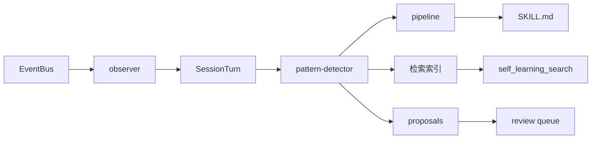

# Runtime Self-Learning

<p align="center">
  <sub>Hanako 插件 · 本地运行时学习引擎</sub>
</p>

<p align="center">
  
  
  
  
  
  
</p>

观察你的交互，从中提取可复用的经验，自动注入到 Hanako Agent 的后续会话中。重复的工作流、反复触发的错误、明确的纠正——全部本地处理，默认不外发任何数据。

```powershell
# 当前最新版
git clone https://github.com/326sun/Hanako-runtime-learner.git
cd Hanako-runtime-learner
npm run install-plugin

# 固定版本
git clone --branch v1.7.1 https://github.com/326sun/Hanako-runtime-learner.git
cd Hanako-runtime-learner
npm run install-plugin
```

升级：`git pull && npm run install-plugin`

## 管道

四层架构：事件捕获 → 模式检测 → 记忆管理与衰减 → 检索与治理。



核心设计决策：

**零运行时依赖** — 纯 JS BM25 倒排索引，CJK 单字加二元组分词，无需 SQLite 或外部分词器。

**艾宾浩斯遗忘曲线** — `score × e^(-λt)`，高频持久，低频自然淘汰。手动批准的模式永不衰减。

**作用域感知检索** — 按项目隔离记忆，跨项目硬拒绝，跨任务软降权。

**原子 I/O** — `writeJson` 通过 `rename` 保证并发安全；mtime 缓存跳过无效磁盘重读。

完整调用拓扑见 [`ARCHITECTURE.md`](ARCHITECTURE.md)。

## API

| 工具 | 用途 |
|---|---|
| `self_learning_search` | 作用域感知检索：BM25 + Gate + 关系重排 + 可选语义 RRF |
| `self_learning_doctor` | 只读健康检查：Good / Warning / Critical + 修复建议 |
| `self_learning_stats` | 统计总览：turns / patterns / proposals / 配置 |
| `self_learning_report` | 结构化学习报告，含待处理提案 |
| `self_learning_activity` | 近 N 天学习活动时间线 |
| `self_learning_control` | 审批、proposal 管理、review queue、diff preview、策略切换、事件链验证、审计导出 |
| `self_learning_open_dir` | 打开数据目录 |

## 配置

完整配置开箱即用。外部网络功能（模型顾问、语义检索）默认关闭，需显式开启。

### 注入与审批

| 键 | 默认 | 说明 |
|---|---|---|
| `governanceProfile` | `balanced` | 策略档：`conservative` / `balanced` / `autonomous` |
| `autoInjectHighConfidence` | `true` | 高置信 pattern 自动注入 SKILL.md |
| `autoApproveHighConfidence` | `true` | 高置信 pattern 免审批 |
| `minInjectScore` | `8` | 注入最低衰减分数 |
| `minInjectCount` | `2` | 注入最少触发次数 |
| `decayHalfLifeDays` | `30` | 艾宾浩斯半衰期，天 |
| `includePendingPreferences` | `false` | 未审核偏好注入开关；默认关闭，未审核纠正仅可检索 |
| `requireReviewForAutoApply` | `false` | 严格审核模式：auto-apply proposal 进入 Review Queue |

### 模型顾问

关闭时零外发。

| 键 | 默认 | 说明 |
|---|---|---|
| `modelAdvisorEnabled` | `false` | 开启后整理 workflow / error / usage 模式。Hanako ≥ 0.305 优先走宿主 utility 模型采样，provider 凭证不经过插件；旧版本或 bus 不可用时回退到配置端点 |
| `modelAdvisorSource` | `official` | `official` / `private` / `off` |
| `modelAdvisorMinIntervalMinutes` | `60` | 最小调用间隔 |
| `modelAdvisorMaxTokens` | `500` | 单次最大输出 |

### 语义检索

关闭时零外发。

| 键 | 默认 | 说明 |
|---|---|---|
| `semanticSearchEnabled` | `false` | 开启后外发查询词与候选文本到 embedding 端点 |
| `semanticEmbeddingBaseUrl` | — | OpenAI 兼容 Base URL |
| `semanticEmbeddingApiKey` | — | API Key |
| `semanticEmbeddingModel` | — | 模型名称 |
| `semanticCacheMaxEntries` | `1000` | 本地向量缓存上限 |

高级调优键（仅 `DEFAULT_CONFIG`，不在设置 UI 暴露）：`maxSkillTokens`、`retrievalCandidateLimit`、`minRetrievalRelative`、`crossTaskPenalty`、`minRetrievalConfidence`、`semanticTopK`、`rrfK`、`durableMemoryMaxCount`。

## 检索

BM25 倒排索引 → 准入 Gate → 关系 / 记忆强度重排 → 可选语义 RRF 融合。

**CJK 分词** — 单字加相邻二元组，`排版` 可命中 `论文排版`，无需外部分词器。

**跨语言同义词** — `coding` ↔ `代码`，`workflow` ↔ `工作流`。

**作用域隔离** — 跨项目记忆硬拒绝（`general` 为通配 sentinel），跨任务软降权。

**语义检索**默认关闭。开启后按内容哈希缓存向量到 `embeddings_cache.json`，端点失败自动退化为纯 BM25。

## 治理

学习结果进入可审计治理链：Proposal → Review Queue → Validation Gate → Event Log。Doctor 健康检查、策略配置档、MemFS 视图、审计包导出与操作示例见 [`docs/GOVERNANCE.md`](docs/GOVERNANCE.md)。

## 数据与隐私

纯本地，路径 `~/.hanako/self-learning/`。`self_learning_open_dir` 可随时打开查看或手动删除。

**本地留存** — `experience_log.jsonl` 保留每轮意图与纠正原文，30 天窗口自动清理。`patterns.json` 中的 preference 原文按 `durableMemoryMaxCount` 上限保留。证据链中的敏感片段（密钥、邮箱、令牌）自动脱敏，仅保存原文哈希用于去重。

**默认不外发**。仅当显式开启 `modelAdvisorEnabled` 或 `semanticSearchEnabled` 时才会外发数据。`preference` 与 `durable` 模式（用户纠正原文、`pin_memory` 内容）永不外发。

## 开发

零外部 npm 依赖，Node ≥ 18。

```powershell
npm run check    # 源文件语法检查
npm test         # 278 项测试
```

项目结构与完整调用拓扑见 [`ARCHITECTURE.md`](ARCHITECTURE.md)。

[MIT](LICENSE) © Sun
