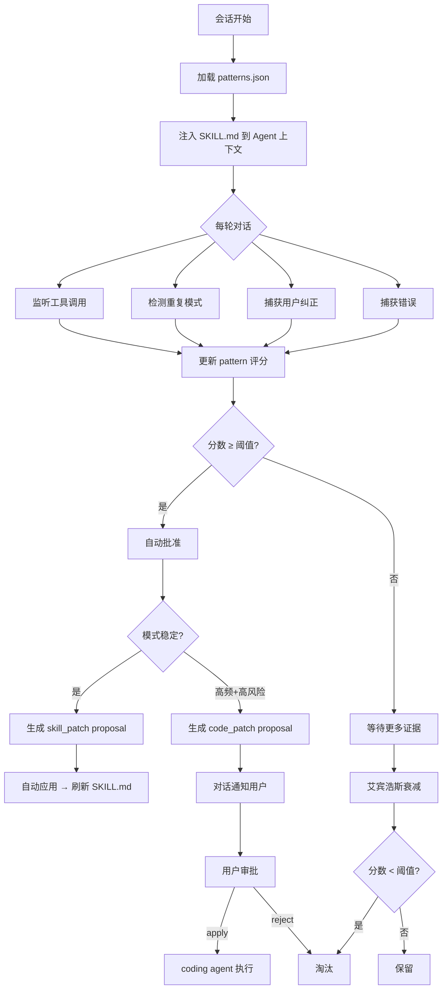

<p align="center">
  <strong>运行时自我学习引擎</strong><br>
  <sub>让 Hanako 从你的交互中持续进化</sub>
</p>

<p align="center">
  
  
  
</p>

---

## 这是什么

Hanako 插件。在本地观察你的交互习惯——重复的工作流、反复触发的错误、明确的纠正——从中提取可复用的经验，在后续对话中自动提醒 Agent。

不是静态知识库，是一个持续运行的进化管道。

---

## 目录

- [快速开始](#快速开始)
- [设计理念](#设计理念)
- [特性](#特性)
- [架构](#架构)
  - [管道流程](#管道流程)
  - [Pi 框架约束](#pi-框架约束)
  - [与官方记忆的关系](#与官方记忆的关系)
- [核心概念](#核心概念)
  - [Pattern](#pattern)
  - [Proposal](#proposal)
  - [艾宾浩斯衰减](#艾宾浩斯衰减)
  - [模型顾问](#模型顾问)
- [API](#api)
  - [工具一览](#工具一览)
  - [self_learning_search](#self_learning_search)
  - [self_learning_control](#self_learning_control)
- [配置](#配置)
- [安装](#安装)
- [数据](#数据)
- [开发](#开发)

---

## 快速开始

```powershell
git clone https://github.com/326sun/hanako-runtime-learner.git
cd hanako-runtime-learner
npm run install-plugin
```

在 Hanako 设置中启用插件，完成。

让 Agent 验证是否正常工作：

```
hanako-runtime-learner_self_learning_stats
```

---

## 设计理念

这个插件经历了三次认知跃迁：

**v0.1–v0.3：被动日志。** 记录每轮对话的工具调用和错误，事后可查，但从不被主动使用。

**v0.4–v0.5：主动模式检测。** 日志积累到一定量后，重复模式自然浮现。加入模式检测器——当工具类别组合或错误类型反复出现时，自动生成 pattern，通过 SKILL.md 注入到 Agent 的下一次会话。

**v0.6+：全自动进化管道。** 引入艾宾浩斯遗忘曲线作为自然淘汰机制——高频高分模式自动批准，低频噪音自然衰减。同时建立提案系统（proposal）：不只是提醒 Agent，而是当模式稳定后，生成代码级或技能级的改进建议。从"让 Agent 知道"跨越到"让 Agent 改进自己"。

当前 v0.7.0 处于第三阶段：全自动批准、模型顾问、官方记忆桥均已启用。

---

## 特性

- 🔍 **模式检测** 从工具调用序列中识别重复的工作流、错误和用户纠偏偏好
- 🧠 **艾宾浩斯衰减** 模拟人类记忆曲线，高频模式持久，低频噪音自动淘汰
- 📝 **改进提案** 稳定模式自动生成技能补丁或代码改进建议
- 🔗 **官方记忆桥** 只读桥接 Hanako 内置记忆，搜索时混合返回
- 🤖 **模型顾问** 用小模型后台整理 pattern，去重合并，提炼表述
- ⚡ **零配置运行** 默认全自动，开箱即用
- 🔒 **全本地** 所有数据落在 `~/.hanako/self-learning/`，不上传

---

## 架构

### 管道流程



### Pi 框架约束

插件运行在 Hanako 的插件沙箱中。以下约束塑造了整个架构设计：

| 能力 | 状态 | 说明 |
|---|---|---|
| 监听运行时事件 | ✅ | 工具调用、会话起止、错误，全部可观测 |
| 读写本地文件 | ✅ | 所有数据落在 `~/.hanako/self-learning/` |
| 通过 SKILL.md 注入提示 | ✅ | 刷新后下一轮对话 Agent 自动加载 |
| 工具接口 | ✅ | 6 个 `self_learning_*` 工具供 Agent 调用 |
| 读取官方记忆 | ✅ | 只读文件桥，读取编译后的 md 文件 |
| 写入官方记忆 | ❌ | 官方记忆系统无稳定插件 API |
| 修改 Hanako 核心 | ❌ | 沙箱隔离 → `code_patch` 需 Agent 手动执行 |
| 改写 Agent 输出 | ❌ | 只能观察和注入，不能实时改写 |
| 持久后台循环 | ❌ | 生命周期绑定会话 → 模型顾问在 turn-complete 触发 |

**关键绕路：**

- 官方记忆无写 API → 只读文件桥，搜索时混合返回，搜索响应中标注 `source` 字段区分
- 无法修改代码 → `code_patch` 提案描述改动，Agent 手动编辑、验证、重装
- 无上下文注入 API → 写入 SKILL.md，依赖 Agent 在下一轮会话中加载

### 与官方记忆的关系

两套系统同时运行，分工不同：

| 维度 | 官方记忆 | 本插件 |
|---|---|---|
| 内容 | 事实性：身份、偏好、背景 | 程序性：工作流、错误、技巧 |
| 写入 | Hanako 核心自动编译 + 手动 pin | 模式检测器发现 + 提案系统生成 |
| 注入 | 系统提示词全量注入 | SKILL.md 按需注入 |
| 淘汰 | 时间衰减 + 手动 | 艾宾浩斯衰减（半衰期 30 天） |
| 数据路径 | `~/.hanako/agents/<agent>/memory/` | `~/.hanako/self-learning/` |

> 官方记忆记住**你是谁**，本插件记住**怎么和你协作更高效**。

---

## 核心概念

### Pattern

最小学习单元。四种类型：

| 类型 | 触发条件 | 示例 |
|---|---|---|
| `workflow` | 某工具类别组合反复出现 | `代码编写 → 文件探索` 连续 7 次 |
| `error` | 某类错误多次触发 | `bash: failed` 出现 23 次 |
| `preference` | 用户明确纠正 Agent 行为 | "不对，本地版本比你给的高很多" |
| `usage` | 用量压力超阈值 | 单轮 token > 120000 |

每个 pattern 携带四项指标：`count`（触发次数）、`decayedScore`（衰减评分）、`status`（pending/approved/rejected）、`injectable`（是否达到注入门槛）。

### Proposal

pattern 积累到一定量后生成的改进建议。两级风险：

- **`skill_patch`（低风险）**：刷新 SKILL.md 内容 → 自动应用
- **`code_patch`（高风险）**：涉及代码变更 → 对话通知，需用户审批

审批流程：

```
插件通知 → show proposal <ID> → apply / reject
```

### 艾宾浩斯衰减

指数衰减，半衰期 30 天。一个 pattern 在触发当天记为初始分（10–20），每过 30 天无新触发则分数减半，90 天后降至原始 1/8，低于最小分数阈值（默认 8 分）就不再注入。

效果：高频有用的模式永久留存，低频噪音自然消失，无需手动清理。

### 模型顾问

每 180 分钟（最少间隔），用小模型后台整理现有 pattern：去重、合并相似项、优化表述。只整理不生成，输出上限 500 tokens。默认跟随 Hanako 设置的小模型（deepseek-v4-flash），也可配私有模型。

---

## API

### 工具一览

| 工具 | 用途 |
|---|---|
| `self_learning_search` | 搜索已学 pattern，可选混合官方记忆 |
| `self_learning_activity` | 查看近 N 天学习活动时间线 |
| `self_learning_stats` | 统计：turns / errors / patterns / 当前配置 |
| `self_learning_report` | 结构化学习报告 |
| `self_learning_control` | 审批 pattern、管理 proposal、修改配置 |
| `self_learning_open_dir` | 在文件管理器中打开数据目录 |

### self_learning_search

```json
// 搜索代码相关工作流
{ "query": "代码编写" }

// 搜索错误模式
{ "query": "bash error", "type": "error" }

// 搜索用户偏好，带任务上下文过滤
{ "query": "论文", "type": "preference", "taskType": "research" }
```

支持参数：`query`（必填）、`type`（workflow / error / preference / all）、`taskType`（file_management / coding / research / planning / general）、`limit`。

搜索采用四路加权检索：文本匹配 + 上下文匹配 + 关系图 boost + 可选官方记忆桥。

### self_learning_control

核心控制接口，按 `action` 分流：

```json
// 查看引擎状态
{ "action": "status" }

// 列出所有 pattern
{ "action": "list" }

// 审批 pattern
{ "action": "approve", "id": "workflow:代码编写→文件探索" }
{ "action": "reject", "id": "error:tool_error" }

// 管理提案
{ "action": "list_proposals", "status": "pending" }
{ "action": "show_proposal", "proposalId": "code_patch:abc123" }
{ "action": "apply_proposal", "proposalId": "code_patch:abc123" }
{ "action": "reject_proposal", "proposalId": "code_patch:abc123", "reason": "不适用当前场景" }

// 修改配置
{ "action": "set_config", "minInjectScore": 10, "decayHalfLifeDays": 14 }

// 手动操作
{ "action": "regenerate_skill" }
{ "action": "run_model_advisor" }
{ "action": "rollback" }
```

---

## 配置

完整 24 项，分为四组。默认值已在括号中标注。

**注入与审批**

| 键 | 默认 | 说明 |
|---|---|---|
| `autoInjectHighConfidence` | `true` | 高置信 pattern 自动注入 SKILL.md |
| `autoApproveHighConfidence` | `true` | 高置信 pattern 跳过人工审批 |
| `minInjectScore` | `8` | 注入最低衰减分数 |
| `minInjectCount` | `2` | 注入最少触发次数 |
| `includePendingPreferences` | `true` | 未审批偏好也参与注入 |
| `decayHalfLifeDays` | `30` | 分数半衰期（天） |

**模型顾问**

| 键 | 默认 | 说明 |
|---|---|---|
| `modelAdvisorEnabled` | `true` | 启用后台整理 |
| `modelAdvisorSource` | `official` | `official` 使用 Hanako 小模型，`private` 使用自配 |
| `modelAdvisorMinIntervalMinutes` | `180` | 两次整理最小间隔 |
| `modelAdvisorMaxTokens` | `500` | 单次整理最大输出 |
| `modelAdvisorBaseUrl` | — | 自配模型的 OpenAI 兼容端点 |
| `modelAdvisorApiKey` | — | 自配模型 API Key |
| `modelAdvisorModel` | — | 自配模型 ID |

**记忆桥**

| 键 | 默认 | 说明 |
|---|---|---|
| `officialMemoryBridgeEnabled` | `true` | 搜索时混合官方记忆 |
| `officialMemoryBridgeMaxResults` | `3` | 官方记忆最大返回条数 |

**用量学习 / 通知**

| 键 | 默认 | 说明 |
|---|---|---|
| `learnFromUsage` | `true` | 从用量元数据中学习 |
| `largeUsageTokenThreshold` | `120000` | 大上下文阈值 |
| `proposalChatNotificationsEnabled` | `true` | 高风险提案在对话中通知 |
| `workStatusEnabled` | `true` | 显示后台工作状态 |
| `workStatusText` | `正在自我整理学习` | 状态文案 |

---

## 安装

### 依赖

- Hanako Agent ≥ v0.293.0
- Node.js ≥ 18
- 插件权限：全权限（`full-access`）

### 步骤

```powershell
# 1. 克隆
git clone https://github.com/326sun/hanako-runtime-learner.git
cd hanako-runtime-learner

# 2. 安装
npm run install-plugin

# 3. 验证
npm run check && npm test
```

在 Hanako 设置中：**允许全权限插件** → **启用 Runtime Self-Learning**。

升级时执行：

```powershell
git pull && npm run install-plugin
```

学习数据（`~/.hanako/self-learning/`）不会被覆盖。更多细节见 [INSTALL.md](./INSTALL.md)。

---

## 数据

所有数据纯本地，路径：

```
~/.hanako/self-learning/
├── patterns.json          # 核心：已学模式及评分
├── config.json            # 运行时配置
├── activity_log.jsonl     # 活动时间线
├── experience_log.jsonl   # 经验日志
├── error_log.jsonl        # 错误日志
├── turns.jsonl            # 每轮工具调用记录
├── usage_summary.json     # Token 用量汇总
├── host_capabilities.json # 宿主能力快照
├── proposals/             # 改进提案（.json）
├── skill_history/         # SKILL.md 历史（最多 20 份）
└── sessions/              # 会话快照
```

硬上限保护：

| 项 | 上限 |
|---|---|
| pattern 总数 | 50 |
| 日志文件 | 10 MB（超阈值触发裁剪） |
| activity log | 500 条 |
| skill history | 20 份 |
| 日志保留 | 30 天 |

---

## 开发

```powershell
# 装依赖
npm install

# 运行测试
npm test

# 代码检查
npm run check

# 手动重建 skill
node tools/regenerate-skill.js
```

插件结构：

```
hanako-runtime-learner/
├── index.js               # 插件入口，事件监听 + 模式检测
├── lib/
│   ├── common.js           # 共享工具、分数计算、SKILL.md 生成
│   ├── hana-runtime-compat.js  # Pi 框架兼容层
│   ├── model-advisor.js    # 模型顾问逻辑
│   ├── official-memory-bridge.js  # 官方记忆只读桥
│   ├── official-utility-model.js  # 小模型读取
│   └── proposals.js        # 提案生成与管理
├── tools/                  # 独立工具脚本
├── skills/                 # 注入给 Agent 的 SKILL.md
├── manifest.json           # 插件声明
└── package.json
```

---

## License

MIT © Sun
