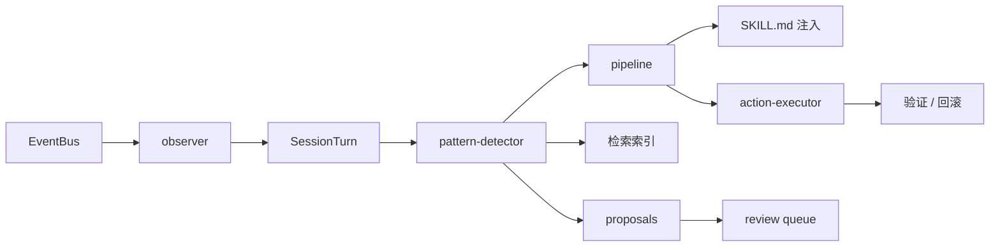

# Runtime Self-Learning

<p align="center">
  <sub>Hanako 插件 · 本地运行时学习引擎</sub>
</p>

<p align="center">
  
  
  
  
  
  
</p>

> 观察你和 Hanako 的真实交互，把重复的工作流、反复踩的错、你给过的纠正学成可复用的经验，并在确有把握时自动写回 Agent 的后续会话——全部在本地完成，默认不外发任何数据。

## 它解决什么

每开一个新会话，Agent 都像第一次见你：同样的工作流要重新解释，同一个错误一犯再犯，你纠正过的偏好转头就忘。

`Runtime Self-Learning` 在后台默默观察，把这些沉淀成带证据、带评分的经验，并在置信度足够时自动注入到 Agent 之后的回答里，让它**越用越懂你的项目和习惯**——而且默认不把任何数据发到本机之外。

## 三件事，以及它的边界

这个插件做三件事：**学习**你的交互、把学到的东西**进化**进 Agent 的行为、在安全边界内**自动执行**一部分补救动作。下面是诚实的范围说明。

### ① 学习 —— 它学什么

| 类型 | 触发条件 |
|---|---|
| **工作流** | 同类工具序列重复 ≥ 3 次 |
| **偏好** | 你给出的纠正原文 |
| **错误** | 反复出现的报错，附「不要这样重试」的修复建议 |
| **用量** | 大上下文、失败的模型请求 |

每条经验都带证据链和艾宾浩斯衰减评分（`score × e^(-λt)`，高频持久、低频自然淘汰），持久化在本地 `patterns.json`。

### ② 进化 —— 学到的东西怎么影响以后

- **自动（默认开）**：高置信度经验会自动写进插件自己的 `SKILL.md`，从而进入 Agent 后续会话的上下文。这是真正影响行为的主路径。
- **证据门控（默认需你点头）**：经过成功验证、零回归的经验可晋升为「已激活技能」，但默认 **不** 回注（`activeSkillsInjectionEnabled = false`），需要你显式开启。

### ③ 自动执行 —— 会做什么，绝不做什么

执行闭环（`触发 → 计划 → 策略门 → 执行 → 验证 → 回滚/反馈`）默认开启，但它执行的是一张**固定的安全清单**，不会拿任意学到的工作流去自由执行：

| | 范围 |
|---|---|
| ✅ **自动执行**（低/中风险） | 错误诊断、一次 backoff 重试、只读定位文件、压缩/拆分超大上下文、跑 test/lint、应用经过 diff 预览的小补丁（R2 封顶） |
| ⏸ **进审批队列**（高风险） | R3/R4 动作只生成 `action_plan`，等你确认，不自动执行 |
| ⛔ **永不自动执行** | 删除文件、`git push`、`git tag`、`npm publish`、发布、外部写请求、密钥/凭证修改 |

每个写动作都有事务保护：**验证不通过自动回滚**；命令默认只允许 `node --check`，其余必须在 allowlist 内；补丁先过 scope gate + diff 预览。设计原则是 fail-closed、不自动升级权限。

## 安装

```powershell
# 最新版
git clone https://github.com/326sun/Hanako-runtime-learner.git
cd Hanako-runtime-learner
npm run install-plugin

# 固定版本
git clone --branch v4.3.0-lts https://github.com/326sun/Hanako-runtime-learner.git
cd Hanako-runtime-learner
npm run install-plugin
```

升级：`git pull && npm run install-plugin`。**升级时别删 `~/.hanako/self-learning`**，否则学习记录会被清空。完整说明见 [INSTALL.md](INSTALL.md)。

## 数据与隐私

- **纯本地**，数据在 `~/.hanako/self-learning/`；在对话里说「打开学习目录」可随时查看或手动删除。
- **默认不外发**。只有显式开启「模型顾问」或「语义检索」才会向你配置的端点发送数据；用户纠正原文、`pin_memory` 内容**永不外发**。
- 证据链中的密钥、邮箱、令牌等敏感片段自动脱敏，仅保留原文哈希用于去重。

## 常用配置

完整配置开箱即用，外部网络功能默认全部关闭。最常调整的几项：

| 键 | 默认 | 说明 |
|---|---|---|
| `governanceProfile` | `balanced` | 策略档：`conservative` / `balanced` / `autonomous` |
| `autoInjectHighConfidence` | `true` | 高置信经验自动写入 `SKILL.md` |
| `decayHalfLifeDays` | `30` | 经验评分半衰期（天） |
| `activeSkillsInjectionEnabled` | `false` | 是否允许「已激活技能」回注 `SKILL.md` |
| `modelAdvisorEnabled` | `false` | 后台小模型整理（关闭即零外发） |
| `semanticSearchEnabled` | `false` | 语义检索（关闭即零外发） |

完整配置项与治理操作示例见 [docs/GOVERNANCE.md](docs/GOVERNANCE.md)。

---

> 以下面向想读源码或二次开发的开发者。

## 架构

四层管道：**观察 → 学习 → 行动 → 治理**。



81 个 lib 模块、9 个工具、1 个入口。完整调用拓扑见 [ARCHITECTURE.md](ARCHITECTURE.md)。

### 核心设计决策

- **零运行时依赖** — 纯 JS BM25 倒排索引，CJK 单字加二元组分词，无需 SQLite 或外部分词器。
- **艾宾浩斯遗忘曲线** — 高频经验持久，低频自然淘汰；手动批准的经验永不衰减。
- **作用域感知检索** — 按项目隔离记忆，跨项目硬拒绝，跨任务软降权。
- **原子 I/O** — 所有 `writeJson` 走 tmp+rename，保证崩溃安全。
- **fail-closed 安全** — scope gate、policy gate、command allowlist 默认全部拒绝。

## 工具 API

| 工具 | 用途 |
|---|---|
| `self_learning_search` | 作用域感知检索：BM25 + Gate + 关系重排 + 可选语义 RRF |
| `self_learning_doctor` | 只读健康检查：Good / Warning / Critical + 修复建议 |
| `self_learning_stats` | 统计总览：turns / patterns / proposals / 配置 |
| `self_learning_report` | 结构化学习报告，含待处理提案 |
| `self_learning_activity` | 近 N 天学习活动时间线 |
| `self_learning_control` | 审批、proposal 管理、review queue、diff preview、策略切换、事件链验证、审计导出、技能晋升 |
| `self_learning_open_dir` | 打开数据目录 |

## 检索

BM25 倒排索引 → 准入 Gate → 关系/记忆强度重排 → 可选语义 RRF 融合。

- **CJK 分词** — 单字加相邻二元组，`排版` 可命中 `论文排版`，无需外部分词器。
- **跨语言同义词** — `coding` ↔ `代码`，`workflow` ↔ `工作流`。
- **作用域隔离** — 跨项目记忆硬拒绝（`general` 为通配 sentinel），跨任务软降权。
- **语义检索** 默认关闭；开启后按内容哈希缓存向量，端点失败自动退化为纯 BM25。

## 治理

学习结果进入可审计治理链：`Proposal → Review Queue → Validation Gate → Event Log`。Doctor 健康检查、策略配置档、MemFS 视图、审计包导出与操作示例见 [docs/GOVERNANCE.md](docs/GOVERNANCE.md)。

## 开发

零外部 npm 依赖，Node ≥ 18。

```powershell
npm run check          # 源文件语法检查
npm test               # 496 项测试
npm run benchmark      # 内置 17 场景 benchmark corpus，输出 Markdown/JSON 报告
npm run release:check  # LTS 发布契约检查：版本、文档、验收报告、benchmark corpus
```

Benchmark runner 用 `benchmarks/baseline-v4.0.9.json` 与 `benchmarks/thresholds.json` 对比当前指标，回归会导致命令失败。发布门禁保守设计：只检查发布元数据和文档，永不执行 `git tag`、`git push`、`npm publish` 或任何外部副作用。

## 冻结文档

API 以 [docs/API_FREEZE.md](docs/API_FREEZE.md) 为准，主架构与自动化边界已冻结。

| 文档 | 内容 |
|---|---|
| [ACTION_API.md](docs/ACTION_API.md) | 自动执行动作 API |
| [POLICY.md](docs/POLICY.md) | 策略门与风险分级 |
| [TRANSACTION.md](docs/TRANSACTION.md) | 可回滚写入事务 |
| [SANDBOX.md](docs/SANDBOX.md) | 命令沙箱与边界 |
| [SKILL_PROMOTION.md](docs/SKILL_PROMOTION.md) | 技能晋升闭环 |
| [AUDIT.md](docs/AUDIT.md) | 审计与事件链 |
| [BENCHMARKS.md](docs/BENCHMARKS.md) | benchmark corpus |
| [MIGRATION_v3_to_v4.md](docs/MIGRATION_v3_to_v4.md) | v3 → v4 迁移 |

完整变更历史见 [CHANGELOG.md](CHANGELOG.md)。

[MIT](LICENSE) © Sun
