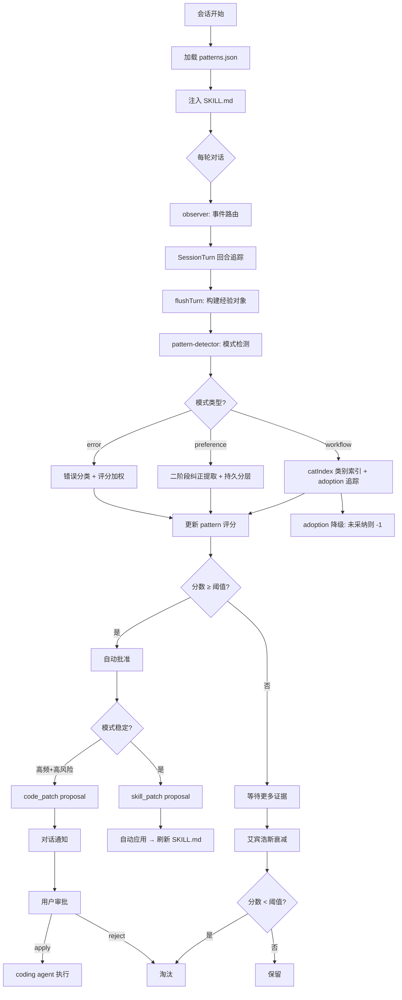

<p align="center">
  <strong>Runtime Self-Learning</strong><br>
  <sub>让 Hanako 从你的交互中持续进化</sub>
</p>

<p align="center">
  
  
  
  
  
</p>

---

## 这是什么

Hanako 插件。本地观察你的交互习惯——重复的工作流、反复触发的错误、明确的纠正——从中提取可复用的经验，自动注入到 Agent 的后续会话中。

v1.6.0 在严格审核与事件回放之上增加治理策略配置档与本地审计包导出：`set_policy_profile` 可在 conservative / balanced / autonomous 三种模式间切换，`export_audit_bundle` 会生成脱敏 JSON + Markdown 审计报告，方便本地排查、合并前 review 或向其他 Agent 交接。

---

## 快速开始

```powershell
git clone https://github.com/326sun/hanako-runtime-learner.git
cd hanako-runtime-learner
npm run install-plugin
```

启用插件后即自动运行。验证：

```
hanako-runtime-learner_self_learning_stats
```

---

## 设计演变

| 阶段 | 版本 | 核心 |
|---|---|---|
| 被动日志 | v0.1–0.3 | 记录工具调用和错误，事后可查 |
| 主动检测 | v0.4–0.5 | 模式浮现时自动生成 pattern，通过 SKILL.md 注入 |
| **全自动进化** | v0.6–0.7 | 艾宾浩斯衰减自然淘汰、提案系统、observer 模块化、官方记忆桥 |
| **管道加固** | **v0.8+** | 深层逻辑修复（忘却失效/竞态/永生缺陷）、采纳追踪重写、bonus 持久化、usage 路径补剪枝 |
| **作用域检索** | **v0.9** | Scope 作用域、CJK-aware BM25 倒排索引、记忆准入 Gate（跨项目/过期/已废弃/低置信拒绝）、检索评估集 |
| **治理与诊断** | **v1.0** | `self_learning_doctor` 只读健康检查：重复/冲突/过期记忆、未审核偏好、提案堆积、SKILL 预算、作用域泄漏、孤儿关系、证据缺失 |
| **证据与时间事实** | **v1.1** | pattern 附带脱敏 `evidence` 证据链、`facts.json` 时间事实（validFrom/validTo/supersedes）、旧事实被覆盖后不再召回、`episodes.jsonl` 情节流 |
| **MemFS 视图** | **v1.2** | 长期记忆生成可读/可审计的 Markdown 文件树、`regenerate_memfs` 重建、doctor 检测视图过期 |
| **语义检索（可选）** | **v1.3** | 可选 embedding（默认关闭、带磁盘缓存）、RRF 融合 BM25+语义+关系+记忆强度、关闭时退化为纯本地 BM25 |
| **学习治理** | **v1.4** | Review Queue、Diff Preview、Validation Gate、append-only Event Log、Skill Registry、Tool-call Repair |
| **严格审核与回放** | **v1.5** | `requireReviewForAutoApply` 严格审核模式、`apply_review` 审核后应用、`event_summary` 事件回放状态 |
| **策略与审计** | **v1.6** | governance policy profiles（conservative/balanced/autonomous）与本地 audit bundle 导出 |

---

## 架构

### 模块数据流

```
EventBus → observer.js (事件路由)
              ├─ SessionTurn (回合追踪)
              ├─ pattern-detector.js (模式检测 + catIndex)
              │     ├─ helpers.js (分类/纠正)
              │     └─ common.js (衰减/分层)
              ├─ proposals.js (提案生成)
              └─ model-advisor.js (后台整理)
                         ↓
                   skills/SKILL.md (注入 Agent 上下文)
```

### 管道流程



---

## 特性

- 🔍 **模式检测** 工具类别组合识别工作流、二阶段正则提取用户纠正、错误分类评分（9 类细分，含可重试/不可重试区分）
- 🧠 **艾宾浩斯衰减** `score × e^(-λt)` 模拟记忆曲线，高频持久，低频自然淘汰
- 🛡️ **忘却一致性** 剪枝时同步清理 seqCache/seqInsertOrder，防止已遗忘模式从旧序列计数满分复活
- ⚡ **计算缓存** `all()` dirty-flag 缓存，每次 flushTurn 从 4 次全量计算降至 1 次
- 📊 **类别索引** `catIndex`（`Map<category, Set<patternId>>`）将关系检测从 O(n²) 降至 O(c × avgPerCat)
- 🔗 **反馈回路** `pin_memory` 直接注入偏好，`self_learning_search` 触发 adoption 追踪
- 🛑 **自强化抑制** 跨窗口累积采纳记录，关闭时只降权从未被采纳的工作流
- 📝 **改进提案** `skill_patch`（自动应用）与 `code_patch`（人工审批）两级风险提案
- 🤖 **模型顾问** 以 ID 新增数而非总数差判断是否运行，对剪枝免疫
- 🔗 **官方记忆桥** 只读桥接 Hanako 内置记忆，搜索时混合返回
- 📐 **CJK token 估算** 中文 1.8 token/字、英文 0.25 token/字分段估算，精度从 ±40% 提升至 ±15%
- ⚡ **I/O 减载** mtime 缓存跳过无变更时的磁盘重读；patterns.json 写入合并为 ~1.5s 去抖

---

## 核心概念

### Pattern 类型

| 类型 | 触发条件 | 示例 |
|---|---|---|
| `workflow` | 跨类别工具组合重复 ≥3 次 | 文件探索→代码编写 |
| `error` | 同类错误多次触发 | permission_denied 出现 5 次 |
| `preference` | 用户明确纠正或 `pin_memory` 操作 | "不对，应该用绝对路径" |
| `usage` | 大上下文或请求失败 | 单轮 >120K tokens |

### 三级知识分区

| 分区 | 衰减 | 说明 |
|---|---|---|
| `durable` | 不衰减 | 用户明确偏好、pin_memory 内容 |
| `core` | 艾宾浩斯曲线 | 工作流、错误、用量等可衰减模式 |
| `ephemeral` | 快速淘汰 | 宿主能力快照等临时信息 |

### token 估算

CJK 感知分段：遍历每个字符，CJK 统一汉字/日文假名/韩文 → 1.8 token，ASCII/其他 → 0.25 token。SKILL.md 在超预算时逐条裁剪而非整节删除，保留高分条目。

---

## API

| 工具 | 用途 |
|---|---|
| `self_learning_search` | 作用域感知检索：CJK-aware BM25 + 准入 Gate + 关系/记忆强度重排 + 官方记忆桥；错误记忆会返回 repairPlan（详见「检索与作用域」） |
| `self_learning_doctor` | 只读健康检查：输出 Good / Warning / Critical + 问题清单与修复建议（详见「健康检查」） |
| `self_learning_activity` | 查看近 N 天学习活动时间线 |
| `self_learning_stats` | 统计：turns / errors / patterns / 配置 |
| `self_learning_report` | 结构化学习报告（含待处理提案） |
| `self_learning_control` | 审批 pattern、管理 proposal、review queue、diff preview、validation gate、事件查看、策略配置档、审计包导出、健康检查与 MemFS 重建 |
| `self_learning_open_dir` | 文件管理器中打开 `~/.hanako/self-learning/` |

---

## 配置

完整配置开箱默认即可用；语义检索、模型顾问和主动对话通知均默认关闭。

**注入与审批**

| 键 | 默认 | 说明 |
|---|---|---|
| `governanceProfile` | `balanced` | 治理策略配置档：`conservative` / `balanced` / `autonomous`。可用 `self_learning_control action=set_policy_profile governanceProfile=conservative` 切换。 |
| `autoInjectHighConfidence` | `true` | 高置信 pattern 自动注入 |
| `autoApproveHighConfidence` | `true` | 高置信 pattern 跳过审批 |
| `minInjectScore` | `8` | 注入最低衰减分数 |
| `minInjectCount` | `2` | 注入最少触发次数 |
| `decayHalfLifeDays` | `30` | 分数半衰期（天） |
| `includePendingPreferences` | `false` | 是否允许**未审核**的偏好提示参与注入。默认关闭：未审核纠正只保留为可检索状态，需经审批或反复强化越过置信阈值后才注入。高级单用户可设为 `true` 以更激进地复用一次性纠正。 |
| `requireReviewForAutoApply` | `false` | 严格审核模式。默认关闭以保持低风险 `skill_patch` 自动应用；开启后，auto-apply proposal 只进入 Review Queue，必须 `approve_review` 后再 `apply_review` / `apply_proposal`。 |

**模型顾问**（默认关闭，开启后跟随 Hanako 小模型）

| 键 | 默认 | 说明 |
|---|---|---|
| `modelAdvisorEnabled` | `false` | 启用后台整理（**需显式开启，会外发数据，见下方「隐私」**） |
| `modelAdvisorSource` | `official` | official / private / off |
| `modelAdvisorMinIntervalMinutes` | `60` | 最小间隔 |
| `modelAdvisorMaxTokens` | `500` | 单次最大输出 |

**语义检索**（默认关闭，开启需配置 embedding 端点，详见「语义检索」与「隐私」）

| 键 | 默认 | 说明 |
|---|---|---|
| `semanticSearchEnabled` | `false` | 启用 RRF 语义融合检索（开启会外发记忆文本） |
| `semanticEmbeddingBaseUrl` | `` | OpenAI 兼容 embedding Base URL |
| `semanticEmbeddingApiKey` | `` | embedding API Key |
| `semanticEmbeddingModel` | `` | embedding 模型名称 |
| `semanticCacheMaxEntries` | `1000` | `embeddings_cache.json` 条目上限，防止长期运行无限增长 |

---

## 检索与作用域（v0.9）

`self_learning_search` 从「字符串包含匹配」升级为「作用域感知的准入检索」。流程：

```text
query
  ↓ CJK-aware 分词 + 跨语言同义词扩展
BM25 倒排索引 Top-K          （lib/memory-index.js）
  ↓
记忆准入 Gate                （lib/memory-gate.js）
  ├─ rejected / ephemeral / 过期 / 已废弃 → 拒绝
  ├─ 跨项目（非 global）            → 拒绝
  └─ 跨任务类型                     → 降权（不拒绝）
  ↓
relationBoost + memoryStrength + scope 重排
  ↓
低置信拒绝（弱相关尾部 + 仅单字 CJK 巧合）
  ↓
Top N（含 scope / evidencePreview / gateReason / scoreBreakdown）
```

**为什么不用 SQLite FTS5**：计划曾建议 FTS5，但本插件坚持零运行时依赖、Node ≥ 18。
FTS5 默认分词器不切分中文（`排版` 无法命中 `论文排版`）。这里改用纯 JS 倒排索引，
对 CJK 同时产出**单字 + 相邻二元组**，无需分词器即可稳定中文召回，且保持零依赖。

**作用域（scope）**：每条 pattern 写入 `{ project, taskType, source }`。`project` 由会话/工作区路径推断，
无法判定时回退 `general`（未作用域，匹配任意查询）。检索默认按项目隔离——跨项目记忆除非标记 `global`
否则不返回；`general` 作为通配 sentinel 两侧互通，保证历史无作用域 pattern 仍可召回。
搜索可传 `project` / `taskType` 参数显式限定。

> 当前 `project` 多为 `general`（写入侧路径推断有限），跨项目隔离机制已就位，
> 待显式项目信号（v1.1 facts / 用户指定）增强后自然生效。

**检索调优键**（仅 `DEFAULT_CONFIG`，不在设置 UI 暴露）：`retrievalCandidateLimit`、
`minRetrievalRelative`、`crossTaskPenalty`、`minRetrievalConfidence`。

---

## 健康检查（v1.0）

自学习系统跑得越久，治理比新功能越重要。`self_learning_doctor` 是**只读**诊断——
扫描记忆状态、给出 Good / Warning / Critical 与可执行修复建议，**不修改任何文件**。

```text
self_learning_doctor                # 人类可读报告
self_learning_doctor format=json    # 结构化 JSON
# 也可经 control 调用：self_learning_control action=doctor [format=json]
```

检查项：

| 检查项 | 触发 | 严重度 |
|---|---|---|
| `duplicate_patterns` | desc/fix 完全相同的重复 pattern | warning |
| `conflicting_facts` | 同 subject/predicate 多个有效值（facts，v1.1 生效） | high |
| `stale_auto_approved` | 自动批准但长期未采纳、已老化 | warning |
| `pending_preference_injection` | `includePendingPreferences` 开启且存在未审核偏好 | high |
| `pending_preference_backlog` | 未审核偏好堆积（opt-in 关闭时仅提示） | info |
| `proposal_backlog` | 待处理提案 ≥10（≥25 升级 critical） | warning/critical |
| `skill_budget` | 可注入提示超出 `maxSkillTokens`，低价值条目被裁剪 | info |
| `privacy_retention` | 日志存在超过 30 天的条目 | warning |
| `scope_leakage` | 可注入 pattern 横跨多个具体项目 | info |
| `orphan_relations` | 关系边指向已不存在的 pattern | warning |
| `evidence_missing` | 高分 pattern 缺证据（仅当证据特性启用，v1.1） | info |

评分从 100 起按严重度扣分；存在 critical 或分数 < 50 → Critical，存在 high/warning 或分数 < 80 → Warning，否则 Good。

---

## 长期记忆视图 · MemFS（v1.2）

`patterns.json` 是机器源，但人读不便。MemFS 把**当前**长期记忆渲染成一棵可读、可 diff 的 Markdown 文件树（**派生视图，非源数据，随时可删可重建**）：

```text
memfs/
├── system/{user_profile,hard_constraints,active_projects}.md
├── projects/<project>.md      # 每个具体项目的工作流/偏好/错误/事实
├── patterns/{workflows,errors,preferences}.md
└── archive/deprecated.md      # 被拒绝模式 + 被覆盖/过期事实
```

```text
self_learning_control action=regenerate_memfs   # 重建视图
```

doctor 会通过指纹检测 memfs 是否落后于 patterns/facts（`memfs_stale`），并建议重建。

---

## 学习治理 · Review / Diff / Validation（v1.4）

v1.4 开始，学习结果进入可审计治理链：

```text
Proposal → Review Queue → Diff Preview → Validation Gate → Apply / Reject → Event Log → Rollback
```

新增控制动作：

| action | 用途 |
|---|---|
| `review_panel` | 汇总待审核 / 阻塞 / 已批准学习项与 doctor 建议 |
| `preview_proposal` | 应用前查看 `skill_patch` / `config_patch` / `code_patch` 改动预览 |
| `validate_proposal` | 运行只读 Validation Gate；失败则阻止 apply |
| `approve_review` / `reject_review` | 审核或拒绝 review item |
| `list_reviews` | 查看 review queue |
| `list_events` | 查看 append-only `event_log.jsonl` 审计事件 |
| `event_summary` | 从事件流回放 proposal/review/skill 等实体的最新状态 |
| `apply_review` | 对已批准 review 执行对应 proposal 的应用，严格审核模式下推荐使用 |

边界：`code_patch` 永远不会被插件自动写代码；它只生成计划、review 记录和验证要求，仍需人工或 coding agent 执行。

---

## 语义检索 · 可选（v1.3）

默认**纯本地 BM25**。当你显式开启 `semanticSearchEnabled` 并配置 OpenAI 兼容 embedding 端点后，检索改用 **RRF（Reciprocal Rank Fusion）** 融合四路排序：

```text
BM25 排名  +  语义(cosine)排名  +  关系排名  +  记忆强度排名
                      ↓ RRF（按位次融合，抗单路极端值）
                  最终排序
```

- **关闭时零依赖、零外发**，行为与之前完全一致（检索评估集不变）。
- 向量按内容哈希缓存到本地 `embeddings_cache.json`，默认最多保留 `semanticCacheMaxEntries=1000` 条；端点失败/超时自动退化为 BM25。
- 高级调优键（仅 `DEFAULT_CONFIG`）：`semanticTopK`、`rrfK`。语义检索只对 BM25 候选集做 RRF 重排，不绕过 BM25 和 Memory Gate 做全量语义召回。

> 设计取舍：语义作为 RRF 的一路而非主召回——这样既提升相关召回，又因 RRF 的位次共识特性不放大误召回（计划 §7.6 验收：False Admission Rate 不上升）。

---

## 隐私

本插件默认**只在本地工作**，但有几处行为需要你知情：

**读取的本地文件**
- `~/.hanako/preferences.json` 与 `~/.hanako/added-models.yaml`：仅在你开启「模型顾问」且来源为 `official` 时读取，用于复用你已配置的小模型端点与 API Key。
- `~/.hanako/agents/*/`（官方记忆桥，只读）：`officialMemoryBridgeEnabled` 开启时，`self_learning_search` 会混合返回你的官方记忆片段。可在配置中关闭。

**本地留存的内容**
- `experience_log.jsonl` 会以明文保存每轮的用户最后一句意图与「纠正类」原文，窗口 **30 天**后自动清理。
- `patterns.json` 中的 `preference` 模式包含用户纠正 / `pin_memory` 的原文，按 `durableMemoryMaxCount`（默认 50 条）上限保留。
- `patterns.json` / `facts.json` 中的 `evidence` 证据引用会**截断到 ~160 字并对密钥 / 邮箱 / 令牌等敏感片段做脱敏**，同时保存原文哈希用于去重（不保存敏感原文全文）。
- 随时可用 `self_learning_open_dir` 打开目录查看或手动删除；删除 `~/.hanako/self-learning/` 即可清空全部学习数据。

**是否离开本机**
- **默认不外发。** 只有当你显式将 `modelAdvisorEnabled` 设为 `true` 时，插件才会把**归纳后的 workflow / error / usage 模式**（受速率限制，默认每 60 分钟一次）发送到你配置的小模型端点。
- **`preference` 与 `durable` 模式（即用户纠正原文、`pin_memory` 内容）永不外发**，仅参与本地检索与 SKILL.md 注入。
- 关闭外发：将 `modelAdvisorEnabled` 设为 `false` 或 `modelAdvisorSource` 设为 `off`。
- **语义检索（默认关闭）**：仅当你显式将 `semanticSearchEnabled` 设为 `true` 并配置 embedding 端点时，插件才会把**查询词与候选记忆文本**发送到该端点换取向量（结果缓存在本地 `embeddings_cache.json`）。关闭时检索完全在本地完成。

---

## 安装

Hanako Agent ≥ v0.293.0 / Node.js ≥ 18 / `full-access` 权限。

```powershell
git clone https://github.com/326sun/hanako-runtime-learner.git
cd hanako-runtime-learner
npm run install-plugin
```

升级：`git pull && npm run install-plugin`（学习数据 `~/.hanako/self-learning/` 不会被覆盖）

---

## 数据

纯本地，路径 `~/.hanako/self-learning/`：

```
~/.hanako/self-learning/
├── patterns.json          # 已学模式及评分（含 scope / evidence，上限 50）
├── facts.json             # 时间事实（subject/predicate/object + 有效期 + supersedes）
├── config.json            # 运行时配置
├── activity_log.jsonl     # 活动时间线（上限 500 条）
├── experience_log.jsonl   # 经验日志（30 天窗口）
├── episodes.jsonl         # 结构化情节流（provenance，30 天窗口）
├── error_log.jsonl        # 错误日志
├── embeddings_cache.json  # 语义向量缓存（仅启用语义检索时）
├── proposals/             # 改进提案 .json
├── memfs/                 # 长期记忆的 Markdown 只读视图（regenerate_memfs 重建）
├── skill_history/         # SKILL.md 历史快照（上限 20）
└── sessions/              # 会话快照
```

---

## 开发

```
hanako-runtime-learner/
├── index.js                   # 插件入口，生命周期调度
├── lib/
│   ├── observer.js             # 事件订阅与回合生命周期
│   ├── pattern-detector.js     # 核心模式检测引擎 + catIndex + prune 统一
│   ├── common.js               # 艾宾浩斯衰减、知识分层、SKILL.md 生成
│   ├── helpers.js              # 工具/错误分类、纠正提取、常量
│   ├── session-turn.js         # 单回合工具/错误/文本追踪
│   ├── skill-lifecycle.js      # SKILL.md 生命周期与 token 裁剪
│   ├── usage.js                # 用量追踪与去重持久化
│   ├── proposals.js            # 改进提案生命周期
│   ├── model-advisor.js        # 小模型后台整理
│   ├── official-memory-bridge.js  # 官方记忆只读桥
│   ├── official-utility-model.js  # 小模型端点解析
│   └── hana-runtime-compat.js  # Pi 框架兼容层
├── tools/                      # 7 个独立工具
├── tests/                      # 235 项测试
├── skills/                     # SKILL.md 注入
└── manifest.json
```

```powershell
npm install
npm run check   # 源文件语法检查
npm test        # 128 项测试
```

---

## License

MIT © Sun
