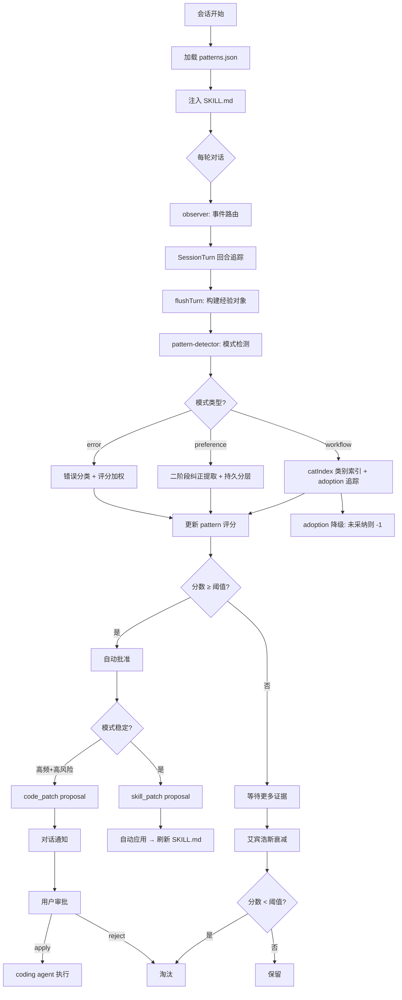

<p align="center">
  <strong>Runtime Self-Learning</strong><br>
  <sub>让 Hanako 从你的交互中持续进化</sub>
</p>

<p align="center">
  
  
  
  
  
</p>

---

## 这是什么

Hanako 插件。本地观察你的交互习惯——重复的工作流、反复触发的错误、明确的纠正——从中提取可复用的经验，自动注入到 Agent 的后续会话中。

v0.8.1 在管道完整性的基础上进行了两轮深层逻辑修复——剪枝后序列缓存未清理导致的忘却失效、工作流 taskType 累积重复、人工承认未清除 autoApproved 标记等 13 处修正，管道的自我一致性得到实质性加固。

---

## 快速开始

```powershell
git clone https://github.com/326sun/hanako-runtime-learner.git
cd hanako-runtime-learner
npm run install-plugin
```

启用插件后即自动运行。验证：

```
hanako-runtime-learner_self_learning_stats
```

---

## 设计演变

| 阶段 | 版本 | 核心 |
|---|---|---|
| 被动日志 | v0.1–0.3 | 记录工具调用和错误，事后可查 |
| 主动检测 | v0.4–0.5 | 模式浮现时自动生成 pattern，通过 SKILL.md 注入 |
| **全自动进化** | v0.6–0.7 | 艾宾浩斯衰减自然淘汰、提案系统、observer 模块化、官方记忆桥 |
| **管道加固** | **v0.8+** | 深层逻辑修复（忘却失效/竞态/永生缺陷）、采纳追踪重写、bonus 持久化、usage 路径补剪枝 |

---

## 架构

### 模块数据流

```
EventBus → observer.js (事件路由)
              ├─ SessionTurn (回合追踪)
              ├─ pattern-detector.js (模式检测 + catIndex)
              │     ├─ helpers.js (分类/纠正)
              │     └─ common.js (衰减/分层)
              ├─ proposals.js (提案生成)
              └─ model-advisor.js (后台整理)
                         ↓
                   skills/SKILL.md (注入 Agent 上下文)
```

### 管道流程



---

## 特性

- 🔍 **模式检测** 工具类别组合识别工作流、二阶段正则提取用户纠正、错误分类评分（9 类细分，含可重试/不可重试区分）
- 🧠 **艾宾浩斯衰减** `score × e^(-λt)` 模拟记忆曲线，高频持久，低频自然淘汰
- 🛡️ **忘却一致性** 剪枝时同步清理 seqCache/seqInsertOrder，防止已遗忘模式从旧序列计数满分复活
- ⚡ **计算缓存** `all()` dirty-flag 缓存，每次 flushTurn 从 4 次全量计算降至 1 次
- 📊 **类别索引** `catIndex`（`Map<category, Set<patternId>>`）将关系检测从 O(n²) 降至 O(c × avgPerCat)
- 🔗 **反馈回路** `pin_memory` 直接注入偏好，`self_learning_search` 触发 adoption 追踪
- 🛑 **自强化抑制** 跨窗口累积采纳记录，关闭时只降权从未被采纳的工作流
- 📝 **改进提案** `skill_patch`（自动应用）与 `code_patch`（人工审批）两级风险提案
- 🤖 **模型顾问** 以 ID 新增数而非总数差判断是否运行，对剪枝免疫
- 🔗 **官方记忆桥** 只读桥接 Hanako 内置记忆，搜索时混合返回
- 📐 **CJK token 估算** 中文 1.8 token/字、英文 0.25 token/字分段估算，精度从 ±40% 提升至 ±15%
- ⚡ **I/O 减载** mtime 缓存跳过无变更时的磁盘重读；patterns.json 写入合并为 ~1.5s 去抖

---

## 核心概念

### Pattern 类型

| 类型 | 触发条件 | 示例 |
|---|---|---|
| `workflow` | 跨类别工具组合重复 ≥3 次 | 文件探索→代码编写 |
| `error` | 同类错误多次触发 | permission_denied 出现 5 次 |
| `preference` | 用户明确纠正或 `pin_memory` 操作 | "不对，应该用绝对路径" |
| `usage` | 大上下文或请求失败 | 单轮 >120K tokens |

### 三级知识分区

| 分区 | 衰减 | 说明 |
|---|---|---|
| `durable` | 不衰减 | 用户明确偏好、pin_memory 内容 |
| `core` | 艾宾浩斯曲线 | 工作流、错误、用量等可衰减模式 |
| `ephemeral` | 快速淘汰 | 宿主能力快照等临时信息 |

### token 估算

CJK 感知分段：遍历每个字符，CJK 统一汉字/日文假名/韩文 → 1.8 token，ASCII/其他 → 0.25 token。SKILL.md 在超预算时逐条裁剪而非整节删除，保留高分条目。

---

## API

| 工具 | 用途 |
|---|---|
| `self_learning_search` | 四路加权检索：文本 + 上下文 + 关系 boost + 官方记忆桥 |
| `self_learning_activity` | 查看近 N 天学习活动时间线 |
| `self_learning_stats` | 统计：turns / errors / patterns / 配置 |
| `self_learning_report` | 结构化学习报告（含待处理提案） |
| `self_learning_control` | 审批 pattern、管理 proposal、修改配置、运行模型顾问 |
| `self_learning_open_dir` | 文件管理器中打开 `~/.hanako/self-learning/` |

---

## 配置

完整 24 项，开箱默认即可用。

**注入与审批**

| 键 | 默认 | 说明 |
|---|---|---|
| `autoInjectHighConfidence` | `true` | 高置信 pattern 自动注入 |
| `autoApproveHighConfidence` | `true` | 高置信 pattern 跳过审批 |
| `minInjectScore` | `8` | 注入最低衰减分数 |
| `minInjectCount` | `2` | 注入最少触发次数 |
| `decayHalfLifeDays` | `30` | 分数半衰期（天） |

**模型顾问**（默认关闭，开启后跟随 Hanako 小模型）

| 键 | 默认 | 说明 |
|---|---|---|
| `modelAdvisorEnabled` | `false` | 启用后台整理（**需显式开启，会外发数据，见下方「隐私」**） |
| `modelAdvisorSource` | `official` | official / private / off |
| `modelAdvisorMinIntervalMinutes` | `60` | 最小间隔 |
| `modelAdvisorMaxTokens` | `500` | 单次最大输出 |

---

## 隐私

本插件默认**只在本地工作**，但有几处行为需要你知情：

**读取的本地文件**
- `~/.hanako/preferences.json` 与 `~/.hanako/added-models.yaml`：仅在你开启「模型顾问」且来源为 `official` 时读取，用于复用你已配置的小模型端点与 API Key。
- `~/.hanako/agents/*/`（官方记忆桥，只读）：`officialMemoryBridgeEnabled` 开启时，`self_learning_search` 会混合返回你的官方记忆片段。可在配置中关闭。

**本地留存的内容**
- `experience_log.jsonl` 会以明文保存每轮的用户最后一句意图与「纠正类」原文，窗口 **30 天**后自动清理。
- `patterns.json` 中的 `preference` 模式包含用户纠正 / `pin_memory` 的原文，按 `durableMemoryMaxCount`（默认 50 条）上限保留。
- 随时可用 `self_learning_open_dir` 打开目录查看或手动删除；删除 `~/.hanako/self-learning/` 即可清空全部学习数据。

**是否离开本机**
- **默认不外发。** 只有当你显式将 `modelAdvisorEnabled` 设为 `true` 时，插件才会把**归纳后的 workflow / error / usage 模式**（受速率限制，默认每 60 分钟一次）发送到你配置的小模型端点。
- **`preference` 与 `durable` 模式（即用户纠正原文、`pin_memory` 内容）永不外发**，仅参与本地检索与 SKILL.md 注入。
- 关闭外发：将 `modelAdvisorEnabled` 设为 `false` 或 `modelAdvisorSource` 设为 `off`。

---

## 安装

Hanako Agent ≥ v0.293.0 / Node.js ≥ 18 / `full-access` 权限。

```powershell
git clone https://github.com/326sun/hanako-runtime-learner.git
cd hanako-runtime-learner
npm run install-plugin
```

升级：`git pull && npm run install-plugin`（学习数据 `~/.hanako/self-learning/` 不会被覆盖）

---

## 数据

纯本地，路径 `~/.hanako/self-learning/`：

```
~/.hanako/self-learning/
├── patterns.json          # 已学模式及评分（上限 50）
├── config.json            # 运行时配置
├── activity_log.jsonl     # 活动时间线（上限 500 条）
├── experience_log.jsonl   # 经验日志（30 天窗口）
├── error_log.jsonl        # 错误日志
├── proposals/             # 改进提案 .json
├── skill_history/         # SKILL.md 历史快照（上限 20）
└── sessions/              # 会话快照
```

---

## 开发

```
hanako-runtime-learner/
├── index.js                   # 插件入口，生命周期调度
├── lib/
│   ├── observer.js             # 事件订阅与回合生命周期
│   ├── pattern-detector.js     # 核心模式检测引擎 + catIndex + prune 统一
│   ├── common.js               # 艾宾浩斯衰减、知识分层、SKILL.md 生成
│   ├── helpers.js              # 工具/错误分类、纠正提取、常量
│   ├── session-turn.js         # 单回合工具/错误/文本追踪
│   ├── skill-lifecycle.js      # SKILL.md 生命周期与 token 裁剪
│   ├── usage.js                # 用量追踪与去重持久化
│   ├── proposals.js            # 改进提案生命周期
│   ├── model-advisor.js        # 小模型后台整理
│   ├── official-memory-bridge.js  # 官方记忆只读桥
│   ├── official-utility-model.js  # 小模型端点解析
│   └── hana-runtime-compat.js  # Pi 框架兼容层
├── tools/                      # 7 个独立工具
├── tests/                      # 128 项测试
├── skills/                     # SKILL.md 注入
└── manifest.json
```

```powershell
npm install
npm run check   # 源文件语法检查
npm test        # 128 项测试
```

---

## License

MIT © Sun
